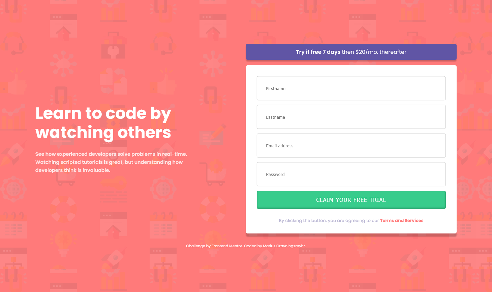

# Frontend Mentor - Intro component with sign up form solution

This is a solution to the [Intro component with sign up form challenge on Frontend Mentor](https://www.frontendmentor.io/challenges/intro-component-with-signup-form-5cf91bd49edda32581d28fd1). Frontend Mentor challenges help you improve your coding skills by building realistic projects.

## Table of contents

- [Overview](#overview)
  - [The challenge](#the-challenge)
  - [Screenshot](#screenshot)
  - [Links](#links)
- [My process](#my-process)
  - [Built with](#built-with)
  - [What I learned](#what-i-learned)
  - [Continued development](#continued-development)
  - [Useful resources](#useful-resources)
- [Author](#author)

### Screenshot

### Links

- Live Site URL: [https://signup-5f559a.netlify.app](https://signup-5f559a.netlify.app)
- Solution URL: [https://github.com/mariusgrHiof/intro-component-with-signup-form-master](https://github.com/mariusgrHiof/intro-component-with-signup-form-master)

## My process

I started to structure the HTML and then adding CSS. Then I started to add JavaScript to handle inputs from the user. In the end, I created media queries to make the site responsive on tablet and mobile devices.

### Built with

- Semantic HTML5 markup
- CSS
- CSS custom properties
- Flexbox
- JavaScript
- Netlify

### What I learned

I've learned how to validate inputs from the user.

### Continued development

I'm going to enhance my JavaScript skills by continue creating more interactive sites.

## Author

- Frontend Mentor - [@mariusgrHiof](https://www.frontendmentor.io/profile/mariusgrHiof)
- Twitter - [@Marius22261747](https://www.twitter.com/Marius22261747)
